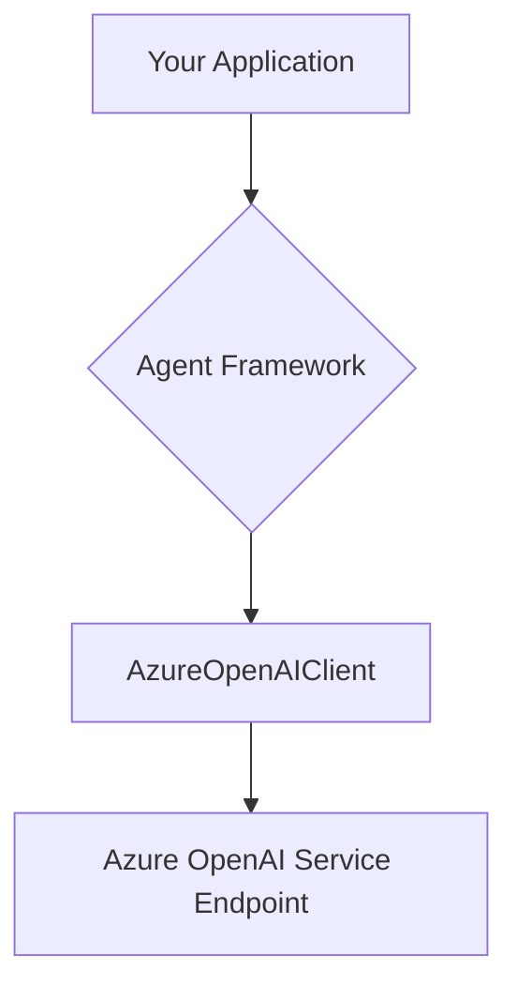
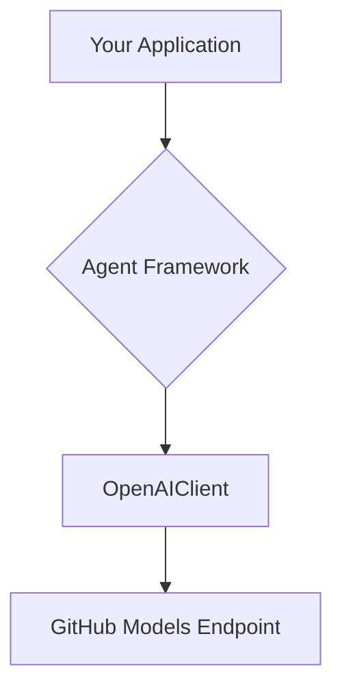
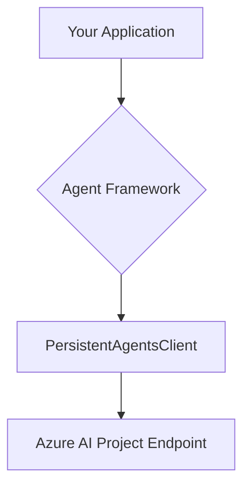

# Using the Agent Framework to Connect Different AI Solutions

The Agent Framework provides a unified interface for interacting with various AI models and services. This tutorial demonstrates how to connect to four different AI solutions—Azure OpenAI Service, GitHub Models, Azure AI Foundry, and Foundry Local—using the framework's implementations in both .NET (C\#) and Python.

## Configuration and Setup

Before running any of the examples, you need to configure your environment variables. The framework uses these variables to connect to the different AI endpoints. Create a `.env` file in the root of your project and populate it with the necessary credentials and endpoints.

[cite\_start]You can use the `.env.examples` file as a template[cite: 1]:

```env
# For GitHub Models
GITHUB_TOKEN="Your GitHub Models Token"
GITHUB_ENDPOINT="Your GitHub Models Endpoint"
GITHUB_MODEL_ID="Your GitHub Model ID"

# For Azure OpenAI Service
AZURE_OPENAI_ENDPOINT="Your Azure OpenAI Endpoint"
AZURE_OPENAI_CHAT_DEPLOYMENT_NAME ="Your Azure OpenAI Model Deployment Name"

# For Foundry Local
FOUNDRYLOCAL_ENDPOINT="http://localhost:5272/v1"
FOUNDRYLOCAL_MODEL_DEPLOYMENT_NAME="Your Local Model Name (e.g., Qwen3-0.6b-cpu)"

# For Azure AI Foundry (Azure AI Studio)
AZURE_AI_PROJECT_ENDPOINT ="Your Azure AI Foundry Project Endpoint"
AZURE_AI_MODEL_DEPLOYMENT_NAME ="Your Azure AI Foundry Project Deployment Name"
```

-----

## 1\. Connecting to Azure OpenAI Service

This section shows how to use the Agent Framework to connect to models deployed in Azure OpenAI Service.

### Connection Architecture

The framework uses a dedicated `AzureOpenAIClient` to handle authentication and communication with the Azure OpenAI endpoint.



### .NET / C\# Implementation

The .NET example uses the `Azure.AI.OpenAI` and `Microsoft.Agents.AI` libraries to create a client and run the agent.

1.  **Dependencies**: NuGet packages like `Azure.AI.OpenAI`, `Azure.Identity`, and the local `Microsoft.Agents.AI.dll` are required.
2.  **Client Initialization**: The code initializes an `AzureOpenAIClient`, providing the service endpoint and credentials (e.g., `AzureCliCredential`).
3.  **Agent Creation**: The `CreateAIAgent` extension method is called on the chat client to get an agent instance with system instructions.
4.  **Execution**: The agent is run using `RunAsync` or `RunStreamingAsync`.

**Key Code Snippet:**

```csharp
// Load endpoint and model ID from environment variables
var aoai_endpoint = Environment.GetEnvironmentVariable("AZURE_OPENAI_ENDPOINT");
var aoai_model_id = Environment.GetEnvironmentVariable("AZURE_OPENAI_RESPONSES_DEPLOYMENT_NAME");

// Create the agent
AIAgent agent = new AzureOpenAIClient(
    new Uri(aoai_endpoint),
    new AzureCliCredential())
     .GetChatClient(aoai_model_id)
     .CreateAIAgent("You are a helpful assistant.");

// Run the agent and get a response
Console.WriteLine(await agent.RunAsync("Write a haiku about Agent Framework."));
```

### Python Implementation

The Python example uses the `agent_framework.azure` library to achieve the same result.

1.  **Dependencies**: The key libraries are `agent_framework` and `azure-identity`.
2.  **Agent Creation**: The `AzureOpenAIChatClient` is instantiated with a credential object. The `create_agent` method is then called to configure the agent with its instructions.
3.  **Execution**: The `agent.run_stream()` method is used to invoke the agent and stream the response.

**Key Code Snippet:**

```python
from azure.identity import AzureCliCredential
from agent_framework.azure import AzureOpenAIChatClient

# Create an agent with Azure CLI credentials
agent = AzureOpenAIChatClient(credential=AzureCliCredential()).create_agent(
        instructions="You are a helpful weather agent."
)

query = "Write a haiku about Agent Framework."

# Stream the agent's response
async for chunk in agent.run_stream(query):
        if chunk.text:
            print(chunk.text, end="", flush=True)
```

-----

## 2\. Connecting to GitHub Models

GitHub Models provides an OpenAI-compatible API endpoint. This allows the Agent Framework to use its standard `OpenAIClient` to connect.

### Connection Architecture

The connection is made to the GitHub Models endpoint, which behaves like an OpenAI API.



### .NET / C\# Implementation

The approach is similar to connecting to any OpenAI-compatible service.

1.  **Dependencies**: This uses the `Microsoft.Extensions.AI.OpenAI` package and local Agent Framework assemblies.
2.  **Client Initialization**: An `OpenAIClient` is created. The `OpenAIClientOptions` are configured with the GitHub Models endpoint URL, and an `ApiKeyCredential` is used to pass the GitHub token.
3.  **Agent Creation**: The `CreateAIAgent` method is used to instantiate the agent with its system prompt.

**Key Code Snippet:**

```csharp
// Load connection details from environment variables
var github_endpoint = Environment.GetEnvironmentVariable("GITHUB_ENDPOINT");
var github_model_id = Environment.GetEnvironmentVariable("GITHUB_MODEL_ID");
var github_token = Environment.GetEnvironmentVariable("GITHUB_TOKEN");

// Configure client options with the endpoint
var openAIOptions = new OpenAIClientOptions()
{
    Endpoint= new Uri(github_endpoint)
};

// Create the agent with an API key credential
AIAgent agent = new OpenAIClient(new ApiKeyCredential(github_token), openAIOptions)
    .GetChatClient(github_model_id)
    .CreateAIAgent(instructions:"You are a helpful assistant.");

// Run the agent
Console.WriteLine(await agent.RunAsync("Write a haiku about Agent Framework."));
```

### Python Implementation

The Python example uses the `OpenAIChatClient` from the framework.

1.  **Dependencies**: The `agent_framework.openai` and `python-dotenv` libraries are used.
2.  **Client Initialization**: The `OpenAIChatClient` is initialized with the `base_url` pointing to the GitHub endpoint and the `api_key` set to the GitHub token.
3.  **Execution**: A list of `ChatMessage` objects is created and passed to the `client.get_response` method to get a completion.

**Key Code Snippet:**

```python
import os
from dotenv import load_dotenv
from agent_framework import ChatMessage, Role
from agent_framework.openai import OpenAIChatClient

load_dotenv()

# Initialize the client with GitHub endpoint and token
client = OpenAIChatClient(
    base_url=os.environ.get("GITHUB_ENDPOINT"), 
    api_key=os.environ.get("GITHUB_TOKEN"), 
    ai_model_id=os.environ.get("GITHUB_MODEL_ID")
)

# Prepare the messages and get a response
messages = [
        ChatMessage(role=Role.SYSTEM, text="You are a helpful assistant."),
        ChatMessage(role=Role.USER, text="Write a haiku about Agent Framework.")
    ]
response = await client.get_response(messages)
print(response.messages[0].text)
```

-----

## 3\. Connecting to Azure AI Foundry (Azure AI Studio)

Azure AI Foundry allows you to create and manage persistent agents. The Agent Framework provides a client to interact with these stateful agents.

### Connection Architecture

The framework communicates with the Azure AI Project endpoint to interact with specific, persistent agents by name or ID.



### .NET / C\# Implementation

This example uses the `Azure.AI.Agents.Persistent` client library.

1.  **Dependencies**: The primary dependency is the `Azure.AI.Agents.Persistent` NuGet package.
2.  **Client Initialization**: A `PersistentAgentsClient` is created using the Azure AI Project endpoint and a credential.
3.  **Agent Creation/Retrieval**: The code first creates a new persistent agent with `CreateAgentAsync`. The resulting agent metadata is then used to get a runnable `AIAgent` instance with `GetAIAgentAsync`.
4.  **Execution**: Agents in AI Foundry are stateful and operate on threads. A new thread is created with `agent.GetNewThread()`, and the `RunAsync` method is called with both the prompt and the thread.

**Key Code Snippet:**

```csharp
// Load endpoint and model ID from environment variables
var azure_foundry_endpoint = Environment.GetEnvironmentVariable("AZURE_AI_PROJECT_ENDPOINT");
var azure_foundry_model_id = Environment.GetEnvironmentVariable("AZURE_AI_MODEL_DEPLOYMENT_NAME");

// Create the client
var persistentAgentsClient = new PersistentAgentsClient(azure_foundry_endpoint, new AzureCliCredential());

// Create a new persistent agent
var agentMetadata = await persistentAgentsClient.Administration.CreateAgentAsync(
    model: azure_foundry_model_id,
    name: "Agent-Framework",
    instructions: "You are an AI assistant that helps people find information.");

// Get the agent instance and a new thread for conversation
AIAgent agent = await persistentAgentsClient.GetAIAgentAsync(agentMetadata.Value.Id);
AgentThread thread = agent.GetNewThread();

// Run the agent within the context of the thread
Console.WriteLine(await agent.RunAsync("Write a haiku about Agent Framework", thread));
```

### Python Implementation

The Python example uses `AzureAIAgentClient` to interact with persistent agents.

1.  **Dependencies**: `agent_framework.azure` and `azure-identity` are required.
2.  **Client Initialization**: The `AzureAIAgentClient` is initialized with an async credential.
3.  **Agent and Thread Management**: Inside an `async with` block, `client.create_agent` defines a persistent agent. A new conversational context is created with `agent.get_new_thread()`.
4.  **Execution**: `agent.run` is called with the query and the thread object.

**Key Code Snippet:**

```python
from azure.identity.aio import AzureCliCredential
from agent_framework.azure import AzureAIAgentClient

async with AzureCliCredential() as credential, AzureAIAgentClient(async_credential=credential) as client:
    # Create a persistent agent
    agent = client.create_agent(
        name="AgentDemo",
        instructions="You are a helpful assistant."
    )
        
    # Start a new conversation thread
    thread = agent.get_new_thread()
    query = "Write a haiku about Agent Framework."

    # Get the agent's response
    result = await agent.run(query, thread=thread)
    print(f"Agent: {result}\\n")
```

-----

## 4\. Connecting to Foundry Local

Foundry Local serves AI models via a local, OpenAI-compatible API. This makes it easy to test agents with local models without needing cloud resources.

### Connection Architecture

The connection pattern is identical to that of GitHub Models, but the endpoint is a local server address.

```mermaid
graph TD
    A[Your Application] --> B{Agent Framework};
    B --> C[OpenAIClient];
    C --> D[Foundry Local Endpoint (e.g., http://localhost:5272/v1)];
```

### .NET / C\# Implementation

The code is nearly identical to the GitHub Models example, with changes only to the endpoint, model ID, and API key.

1.  **Client Initialization**: The `OpenAIClient` is configured to point to the `FOUNDRYLOCAL_ENDPOINT` (e.g., `http://localhost:5272/v1`).
2.  **Authentication**: Since Foundry Local does not require authentication by default, a dummy API key like `"nokey"` is used.

**Key Code Snippet:**

```csharp
// Get local endpoint and model ID
var foundrylocal_endpoint = Environment.GetEnvironmentVariable("FOUNDRYLOCAL_ENDPOINT");
var foundrylocal_model_id = Environment.GetEnvironmentVariable("FOUNDRYLOCAL_MODEL_DEPLOYMENT_NAME");

// Configure options to point to the local server
var openAIOptions = new OpenAIClientOptions()
{
    Endpoint= new Uri(foundrylocal_endpoint)
};

// Create the agent with a dummy API key
AIAgent agent = new OpenAIClient(new ApiKeyCredential("nokey"), openAIOptions)
    .GetChatClient(foundrylocal_model_id)
    .CreateAIAgent(instructions:"You are a helpful assistant.");

// Run the agent
Console.WriteLine(await agent.RunAsync("Can you introduce yourself?"));
```

### Python Implementation

The Python code is also very similar to the GitHub example, differing only in the client's connection parameters.

1.  **Client Initialization**: The `OpenAIChatClient` is initialized with the `base_url` set to the `FOUNDRYLOCAL_ENDPOINT` from the environment variables.
2.  **Authentication**: The `api_key` is set to `"nokey"`.

**Key Code Snippet:**

```python
import os
from dotenv import load_dotenv
from agent_framework import ChatMessage, Role
from agent_framework.openai import OpenAIChatClient

load_dotenv()

# Initialize client for Foundry Local
client = OpenAIChatClient(
    base_url=os.environ.get("FOUNDRYLOCAL_ENDPOINT"),
    api_key="nokey", 
    ai_model_id=os.environ.get("FOUNDRYLOCAL_MODEL_DEPLOYMENT_NAME")
)

# Prepare messages and execute
messages = [
        ChatMessage(role=Role.SYSTEM, text="You are a helpful assistant."),
        ChatMessage(role=Role.USER, text="Can you introduce yourself?")
    ]

response = await client.get_response(messages)
print(response.messages[0].text)
```